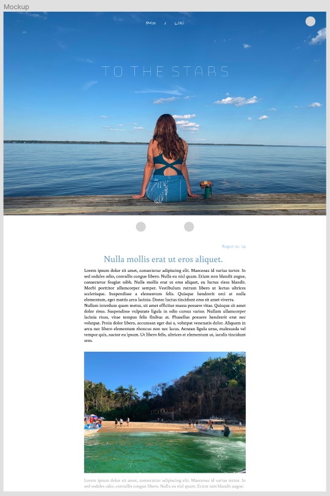
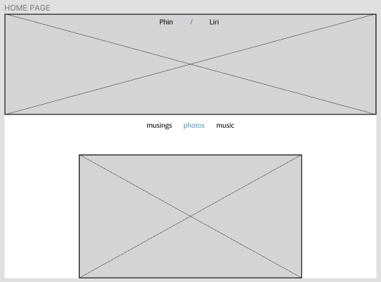
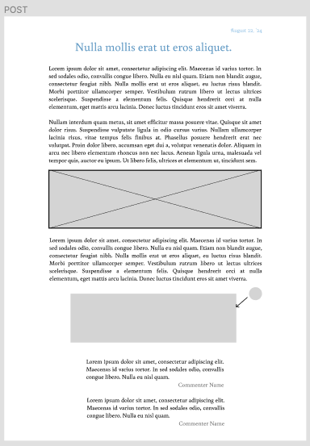

# To the Stars

## Overview

To the Stars is a bespoke, full-stack travelogue platform intended for my partner and I to share our experience with family and friends as we embark on an extended trip around Europe.

### Problem

My partner and I are on the verge of starting an extended trip to Europe that will span several months. We both like writing, my partner enjoys photography, and I love making music. We have dreamt for a long time of an extended travel adventure, which we can document for our family and friends, and for posterity.

Previous attempts to share these experiences have been disjointed, between sending pictures to group chats and sharing Google Photos albums. Having a centralized platform to deliver the content we create will aid us both in inspiration and motivation to continue to document our experiences, and to experience them more insighfully, more memorably. It will also make it easier for our intended audience to be able to stay up to date with what we are doing, and hopefully live our adventure vicariously through us.

### User Profile

1.  **Authors:** My partner and I, principal content creators.
2.  **Logged-in users:** Family, friends, acquaintances, visitors from across the Web who have created an account to enable commenting.
3.  **Visitors:** Family, friends, acquaintances, visitors from across the web.

### Features

-  **As an author**
    - I want to be able to log in to my account.
    - I want to be able to create a post with text, and optionally pictures/videos/songs.
    - I want to be able to edit or delete my previous posts.
    - I want to be able to delete comments site-wide that are inappropriate, or I don't want displayed.
    - I want to be able to respond to comments site-wide.  

-  **As a logged in user**
    - I want to be able to be able to comment on, or like posts to the site.
    - I want to be able to log out.

-  **As a visitor**
    - I want to be able to peruse the content on the site.
    - I want to be able to create an account.

## Implementation

### Tech Stack

- React
- MySQL
- Express
- Client libraries:
	- react
	- react-router
	- react-router-dom
	- axios
    - sass

- Server libraries:
	- knex
    - express

### APIs

The first sprint will not implement any external APIs.

### Sitemap

**Public View**
- *Home* (collection of latest posts by both)
- *Liri* (collection of latest posts by Liri)
	- *Musings* (collection of writing)
	- *Gallery* (collection of photos with captions)
	- *Music* (collection of music with captions/videos)
- *Phin* (collection of latest posts by Phin)
	- *Musings* (collection of writing)
	- *Gallery* (collection of photos with captions)

**Author View**
- *New* page (new post)
- *Old* page (manage old posts)
- *Edit* page (edit single post)

### Mockups

#### Mockup: Home Page

#### Wireframe: Home Page

#### Wireframe: Phin Page

#### Wireframe: Liri Page

#### Wireframe: Single Post

#### Wireframe: Single Comment Form

#### Wireframe: Author Page / New

#### Wireframe: Author Page / Old

#### Wireframe: Author Page / Edit

### Data

### Endpoints

**GET /**

- Get all posts from both authors for the homepage

**GET /phin**

- Get all posts from Phin

**POST /phin**

- Phin makes a post

**DELETE /phin/:postId**

- Delete post by Phin

**PUT /phin/:postId**

- Edit post by Phin

**POST /phin/:postId/comments**

- Make a comment to a post by Phin

**DELETE /phin/:postId/comments/:commentId**

- Make a comment to a post by Phin

**GET /liri**

- Get all posts from Liri

**POST /liri**

- Liri makes a post

**DELETE /liri/:postId**

- Delete post by Liri

**PUT /liri/:postId**

- Edit post by Liri

**POST /liri/:postId/comments**

- Make a comment to a post by Liri

**DELETE /liri/:postId/comments/:commentId**

- Make a comment to a post by Liri

**POST /users/register**

- Users register for an account in order to comment

**POST /users/login**

- Users log in in order to post a comment

### Auth

- JWT auth
    - Before adding auth, all API requests will be using a fake user with id 1
    - Added after core features have first been implemented
    - Store JWT in localStorage, remove when a user logs out
    - Add states for logged in showing different UI in places listed in mockups

## Roadmap

1. Setup and Boilerplate
    - Initialize React project with necessary routes and basic pages
    - Create Express server with initial routing setup and placeholder responses
    
2. Database Setup
    - Create Knex migrations for users, posts, and comments tables
    - Define schema for users table (id, email, password, role)
    - Define schema for posts table (id, user_id, post_type, post_title, post_body, date_posted, post_file)
    - Define schema for comments table (id, post_id, user_id, comment_body, date_commented)

3. Implement form to create new posts (text, photo, song, video)
    - Create POST /posts endpoint to add new posts to the database
    - Display Posts

4. Design and implement home page to display recent posts
    - Create GET /posts endpoint to fetch and display posts
    - Implement pagination for posts listing
    - View and Edit Posts

5. Create post details page to view full post content
    - Implement DELETE /posts/:id endpoint to delete posts
    - Implement UPDATE /posts/:id endpoint to edit existing posts

6. Comments Feature
    - Create comments table schema (id, post_id, user_id, comment, date_commented)
    - Implement form to add comments to posts
    - Create POST /posts/:id/comments endpoint to add comments
    - Display comments on post details page

7. File Uploads
    - Allow users to upload photos, songs, or videos when creating posts
    - Implement file storage using multer and cloud storage (optional)

8. Write unit tests for server endpoints and database queries
    - Implement client-side form validation for user inputs

9. Styling and UI Enhancements
    - Improve overall user interface and user experience
    - Implement responsive design for mobile and desktop views

10. Deployment and Production
    - Deploy client and server applications to my own web space
    - Setup production-ready database (MySQL, PostgreSQL, etc.)

11. Bug Fixes and Optimization
    - Conduct thorough testing to identify and fix any bugs

12. Documentation and Readme
    - Document API endpoints, usage, and expected responses
    - Update project README with detailed instructions for setup and usage

13. Demo and Presentation
    - Prepare for project demo day
    - Showcase features, functionality, and technical aspects
    - Prepare demo video

## Nice-to-haves

- Authentication system for both Authors and Commenters.
- Archives of old posts, for both Visitors and Authors on the Edit page.
- Search functionality for old posts.
- More fleshed out styling for Author pages.
- Elegant animations on user interaction.
- Audio player.