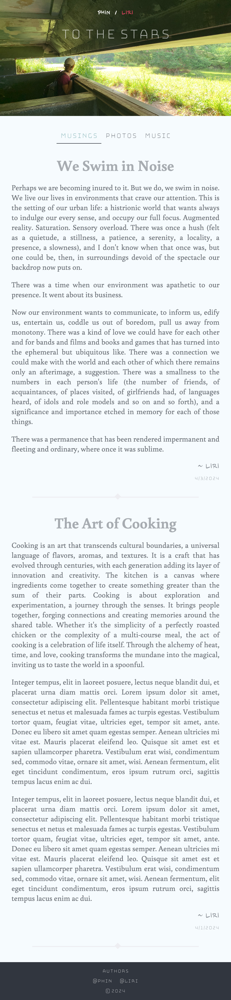
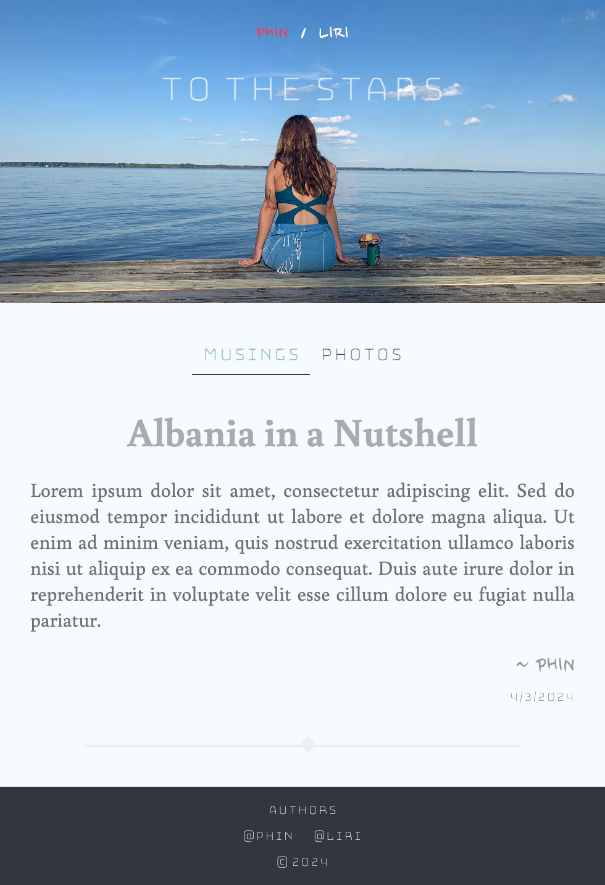
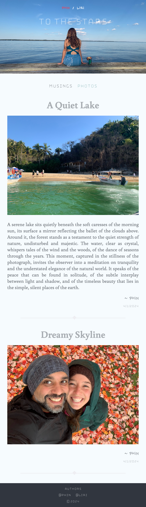
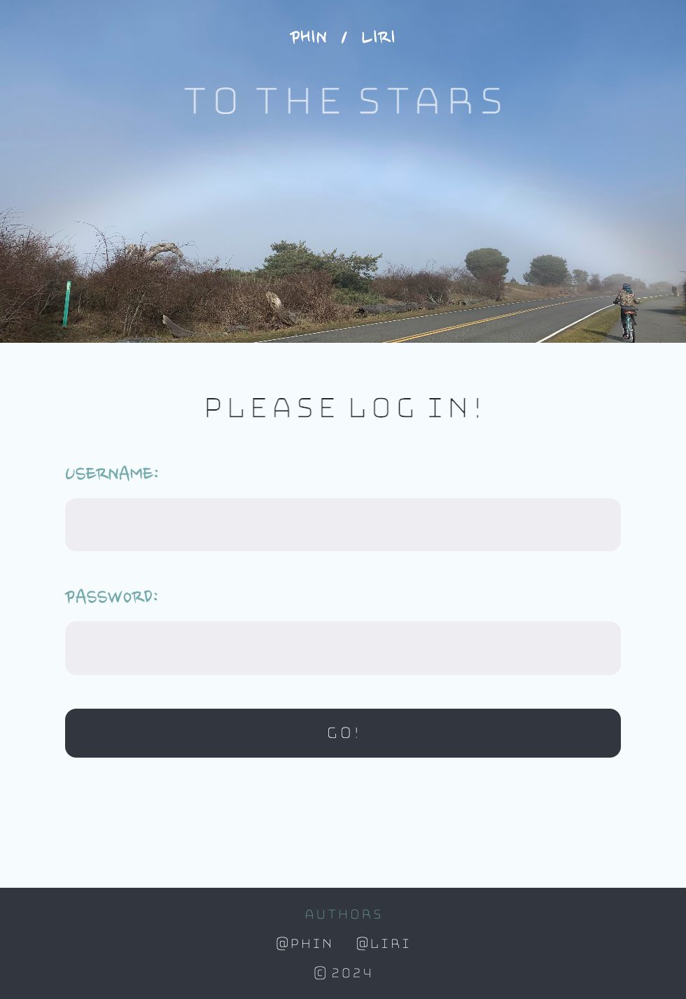
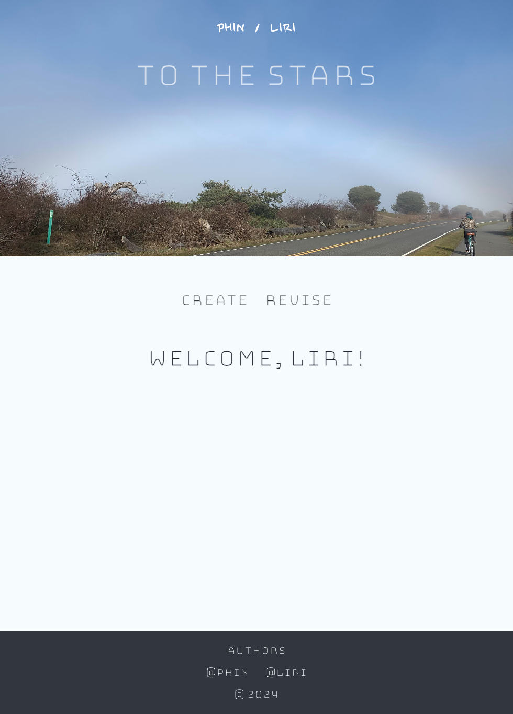
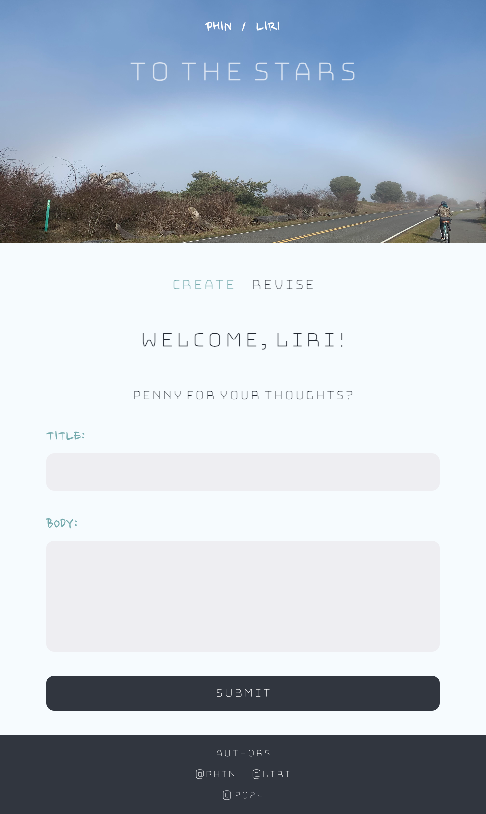
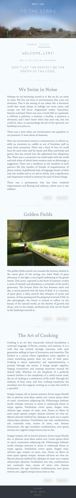

# To the Stars

## Overview

To the Stars is a bespoke, responsive, full-stack travelogue platform intended for my partner and I to share our experience with family and friends as we embark on an extended trip around Europe.

To the Stars was developed as the Capstone project during my studies at BrainStation's January, 2024 Web Development Cohort.

### Problem

During the course of development of this project, my partner and I had just begun a shoestring trip across Europe that would span several months. We both like writing, my partner enjoys photography, and I love making music. We had dreamt for a long time of an extended travel adventure, which we could document for our family and friends, and for posterity.

Previous attempts to share similar experiences had been disjointed, between sending pictures to group chats and sharing Google Photos albums. I hoped having a centralized platform to deliver the content we created would aid us both in inspiration and motivation to continue to document our experiences, and to experience them more insighfully, more memorably. It would also make it easier for our intended audience to be able to stay up to date with what we were doing, and hopefully live our adventure vicariously through us.

### User Profile

1.  **Authors:** My partner and I, principal content creators.
2.  **Logged-in users:** Family, friends, acquaintances, visitors from across the Web who have created an account to enable commenting.
3.  **Visitors:** Family, friends, acquaintances, visitors from across the web.

### Features

-  **Authors**
    - Will be able to log in to their accounts.
    - Will be able to create a post with text, and optionally pictures/videos/songs.
    - Will be able to edit or delete their previous posts.
    - Will be able to delete comments site-wide that are inappropriate, or they want displayed.
    - Will be able to respond to comments site-wide.  

-  **Logged-in Users**
    - Will be able to consume the content created by the authors.
    - Will be able to be able to comment on, or like posts to the site.
    - Will be able to log out.

-  **Visitors**
    - Will be able to peruse the content on the site.
    - Will be able to create an account.

## Instructions

### Installation

1. Clone the repository.
2. Install Node dependencies for both client and server.
3. Create your own .env for both server and client based on included .env.sample file.
4. In command line, navigate to server folder, and run `npm start`.
5. In command line, navigate to client folder, and run `npm start`.

### Usage

- The top menu navigates between the Home Page, and individual Author pages.
- The sub-navigation menu filters between the post categories for each page.
- The Authors link in the page footer navigates to the Authors view.
    - You will need to log in to access this functionality.
    - There are only two users, with names 'phin' and 'liri' (sans quotes).
    - Use the password you created in the client-side .env for either user to log in.
- Once in the Authors page, there are two sub-pages: Create and Revise.
    - The Create page at present only has the ability to create text posts. Different types of posts are in the roadmap.
    - The Revise page at present only has the ability to pull all posts by the logged in author. Edit and Delete functionality is on the roadmap.

## Implementation

### Tech Stack

- React
- MySQL
- Express
- SASS

- Client libraries:
    - vite
	- react
	- react-router
	- react-router-dom
	- axios
    - sass

- Server libraries:
    - cors
    - dotenv
    - multer
    - mysql2
    - nodemon
	- knex
    - express
    - uuid

### APIs

The project does not use any external APIs, but does employ a custom API for retrieving posts from the server side, which itself communicates with the MySQL database through Knex.

### Sitemap

**Public View**
- *Home* (collection of latest posts by both authors)
- *Liri* (collection of latest posts by Liri)
	- *Musings* (collection of writing)
	- *Gallery* (collection of photos with optional titles and captions)
	- *Music* (collection of music and music videos with optional titles and captions)
- *Phin* (collection of latest posts by Phin)
	- *Musings* (collection of writing)
	- *Gallery* (collection of photos with optional titles and captions)

**Author View**
(accessible through the Authors link in the site footer)
- *Login* page (Authors log in here)
- *Create* page (create new posts)
- *Revise* page (edit or delete old posts)

### Screenshots

#### Public View

#### Authors View

### Data

At the time of submission, visitor account creation/login, and commenting functionality is not live, but is planned for the future. Ultimately, the SQL data will look as below:

### API Endpoints

**GET /**

- API welcome message.

**GET /posts**

- Get all posts by both authors.

**GET /posts/musings**

- Get all text posts by both authors.

**GET /posts/photos**

- Get all photo posts by both authors.

**GET /posts/music**

- Get all music posts by Liri.

**POST /posts**

- Create a new post.

**GET /phin**

- Get all posts by Phin.

**GET /phin/musings**

- Get all text posts by Phin.

**GET /phin/photos**

- Get all photo posts by Phin.

**GET /liri**

- Get all posts by Liri.

**GET /liri/musings**

- Get all text posts by Liri.

**GET /liri/photos**

- Get all photo posts by Liri.

**GET /liri/music**

- Get all music posts by Liri.

### Auth

- JWT auth
    - Before adding auth, all API requests will be without authentication.
    - To be added after core features have first been implemented.
    - Store JWT in localStorage, remove when a user logs out.
    - Add states for logged in showing different UI components and states.

## Retrospective

### Planned Features

- Create photo and music posts.
- Edit and delete old posts.
- True authentication system for both Authors and Commenters.
- Ability for logged-in visitors to create comments.
- Ability for authors to delete comments.
- Archives of old posts, for both Visitors and Authors on the Revise page.
- Search functionality for old posts.
- Infinite scrolling for public view pages.
- Audio and video player.

### Lessons Learned

Although the project was envisioned to be minimal in application, it turned out to have a significant amount of complexity in implementation. I ran into several blockers during the course of development, not least of which was the inconvenience of developing on a tight timeline while managing international travel and poor internet connectivity, so in that way, the project itself is a manifestation of the ongoing adventure.

### Farewell

Thank you for checking out my project. You can get in touch with me either through this GitHub page, or [by email](mailto:idlirfida@gmail.com).

So long, and thanks for all the fish.